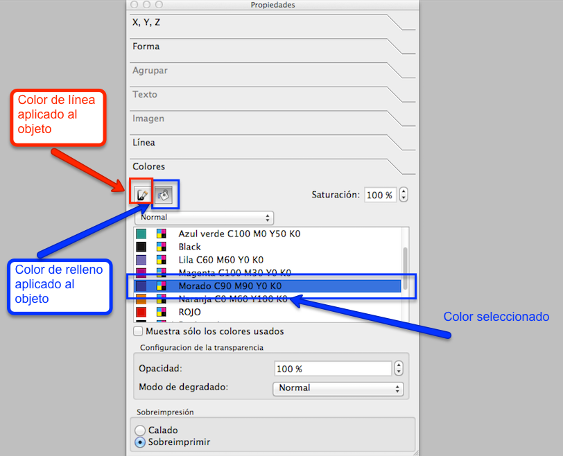
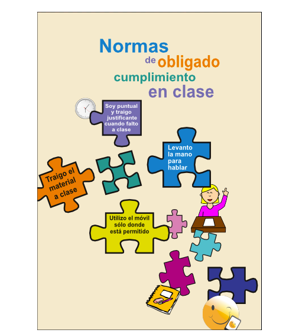
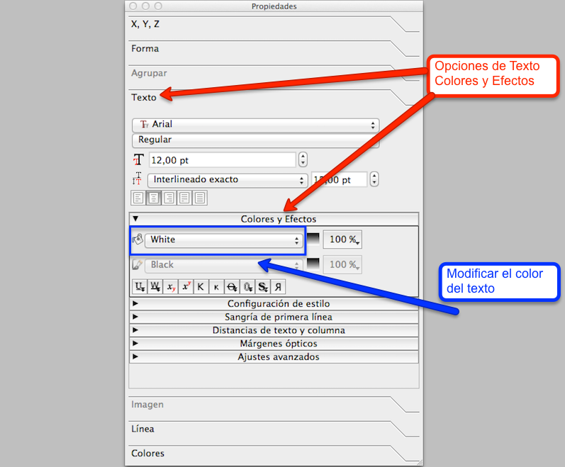

# Concluir la maquetación del cartel

La maquetación del cartel se finalizará utilizando los colores creados en la paleta de colores personalizada. Con el uso del color el cartel captará con más eficacia la atención del público objetivo.

En Scribus, la edición de los colores de los objetos se realiza desde la ventana Propiedades, desde la pestaña "Colores". Para modificar el color de los objetos, se seleccionará el objeto al que se quiere aplicar un nuevo color. Y se seleccionará el color, tal y como se visualiza en la siguiente imagen. 

Apariencia de las opciones de propiedades de los colores en Scribus.

Para finalizar de maquetar el cartel se aplicará color a todas las piezas del puzzle de forma similar a como se visualiza en la siguiente imagen.

Aspecto del cartel a todo color.

Al modificar los colores de las piezas de puzzle, también se tendrá que variar el color de algunos de los textos de color negro para que se visualicen en color blanco, y se visualicen con un mayor contraste. 

Las propiedades de color de los textos se modifican desde la ventana Propiedades, en la pestaña "Texto", tal y como se muestra en la siguiente imagen.

Opciones de las propiedades de los textos en Scribus.

Al finalizar la maquetación del cartel, tendrá una apariencia semejante a la siguiente imagen.

Vista de la maquetación del diseño del cartel finalizado.

