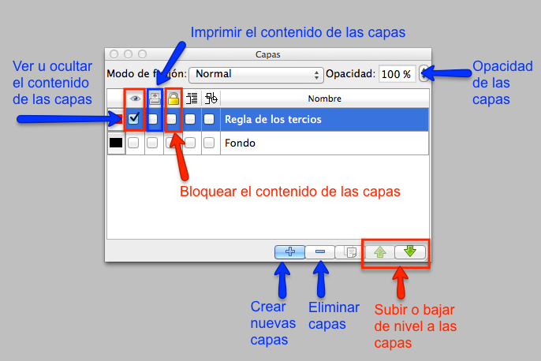
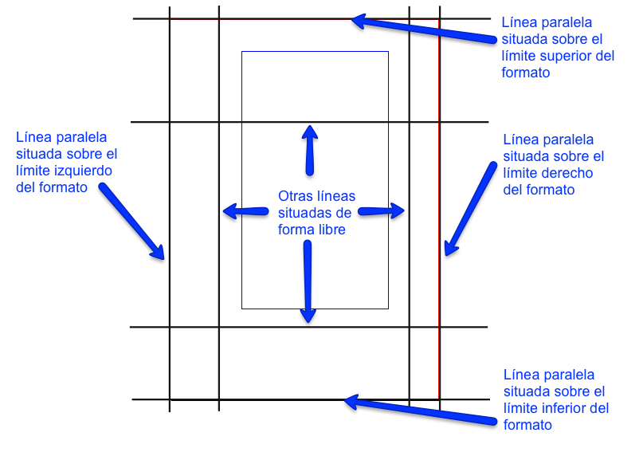
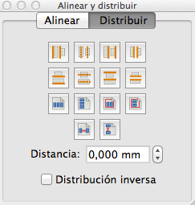
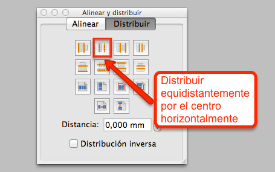
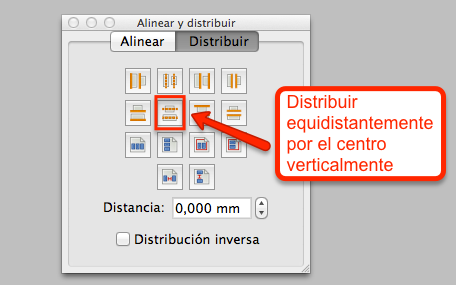
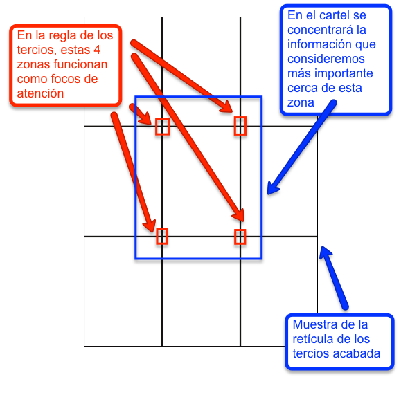

# Crear capas, alinear y distribuir

En ocasiones, para maquetar nos ayudará guiarnos con alguna ESTRUCTURA COMPOSITIVA efectiva. En este caso práctico, para maquetar el cartel usaremos la regla de los tercios.

Para crear una retícula con la regla de los tercios en el documento de Scribus, que nos sirva de referencia durante la maquetación del cartel, nos ayudaremos de la utilidad de Scribus de “Capas”, localizada en el menú principal Ventanas.

Opciones de las capas en Scribus.

Pulsando en el icono “+” crearemos una nueva capa, llamada “Regla de los tercios”. Esta capa nos servirá para generar en ella la retícula compositiva.

Después, usaremos el icono de acceso rápido “Insertar línea” nos ayudará para crear líneas verticales y horizontales con las que construiremos la retícula. Crearemos cuatro líneas verticales de longitud algo mayor que la altura del formato del documento DIN A3. Y, cuatro líneas horizontales de longitud algo mayor que la anchura del formato del documento DIN A3. Posteriormente, colocaremos dos líneas horizontales superpuestas una paralela sobre el límite superior del formato, y otra paralela sobre el límite inferior del formato.

Icono de la herramienta Insertar línea en Scribus.

Y haremos lo mismo con las líneas verticales, colocando una línea paralela sobre el límite izquierdo del formato, y otra paralela sobre el límite derecho del formato. Al finalizar, obtendremos un resultado similar a la siguiente imagen.

Muestra de las posición de las líneas paralelas horizontales y verticales.

Por último, usaremos la herramienta “Alinear y distribuir”, localizada en el menú “Ventanas”.

Opciones de la herramienta “Alinear y Distribuir” en Scribus.

En primer lugar, seleccionaremos todas las líneas verticales y pulsaremos sobre la opción “Distribuir equidistantemente por el centro horizontalmente”. Esta utilidad nos permitirá espaciar todas las líneas con una separación similar uniforme.

Opción “Distribuir equidistantemente por el centro horizontalmente” en Scribus.

Después seleccionaremos todas las líneas horizontales, y pulsaremos sobre la opción

“Distribuir equidistantemente por el centro verticalmente”.

Opción “Distribuir equidistantemente por el centro verticalmente” en Scribus.

 

Y al terminar. la retícula creada tendrá un aspecto similar a la siguiente imagen.

Aspecto final de la retícula de la regla de los tercios en Scribus.

