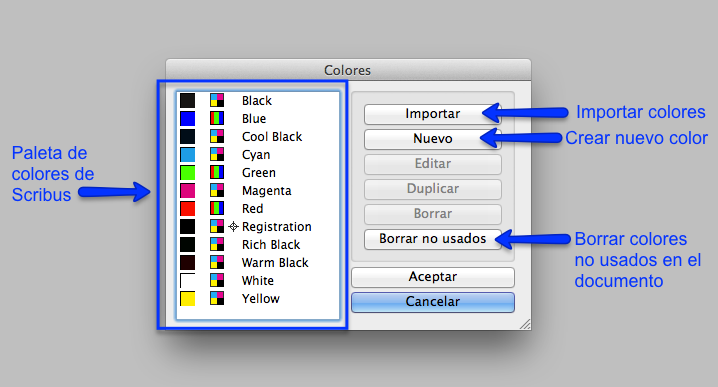
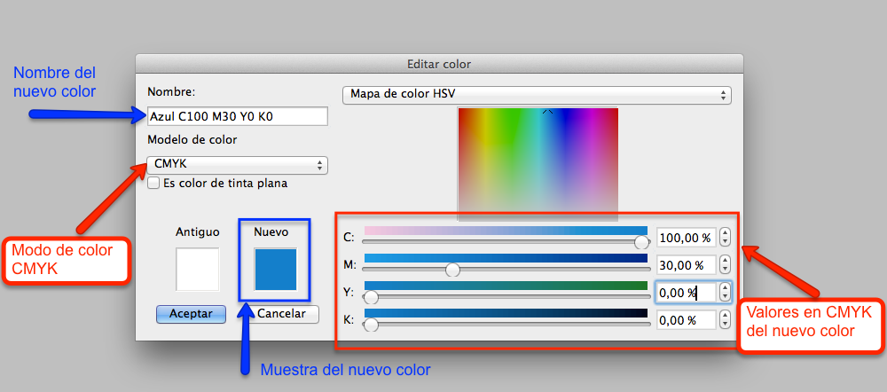
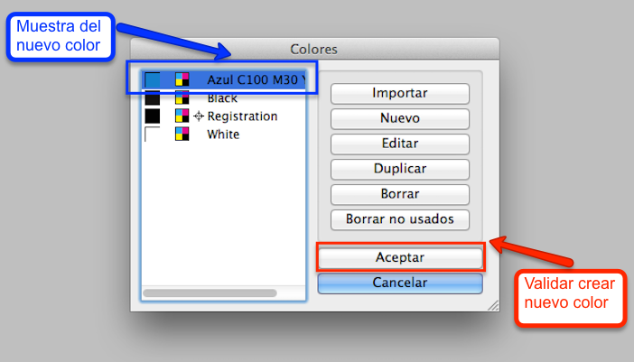
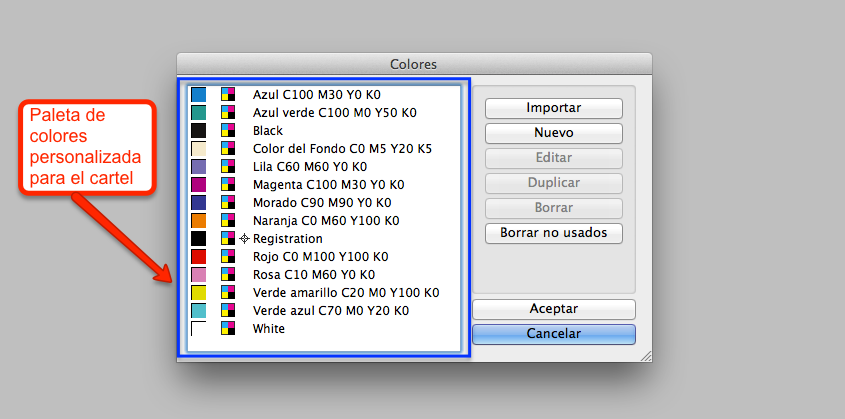

# Crear una paleta personalizada de colores

La EDICIÓN DEL COLOR, en Scribus, se realiza desde el menú Editar, seleccionando la opción "Colores".

Aunque Scribus incorpora una paleta de colores estándar de la aplicación, como la mostrada en la siguiente imagen.

Apariencia de la paleta de colores estándar en Scribus.

En la maquetación del cartel se usará una paleta de colores personalizada. Para crearla, se seleccionará el menú Editar, con la opción "Colores". 

Al abrir la utilidad nos aparecen las opciones de creación de nuevo color. Para crear el primer nuevo color personalizado introduciremos los valores de color CMYK detallados en la siguiente imagen.

Opciones de edición del color en Scribus.

Antes de cerrar la ventana de "Colores", se tiene que validar la creación del nuevo color, tal y como se muestra en la siguiente imagen.

Validación de los nuevos colores creados en Scribus.

Para completar y finalizar la creación de la paleta de colores personalizada, se tendrán que añadir el resto de colores, con sus valores en CMYK. Y la paleta de colores personalizada se visualizará con un listado de colores similar al de la siguiente imagen.

Muestra de la paleta personalizada de colores creada para el diseño del cartel.

