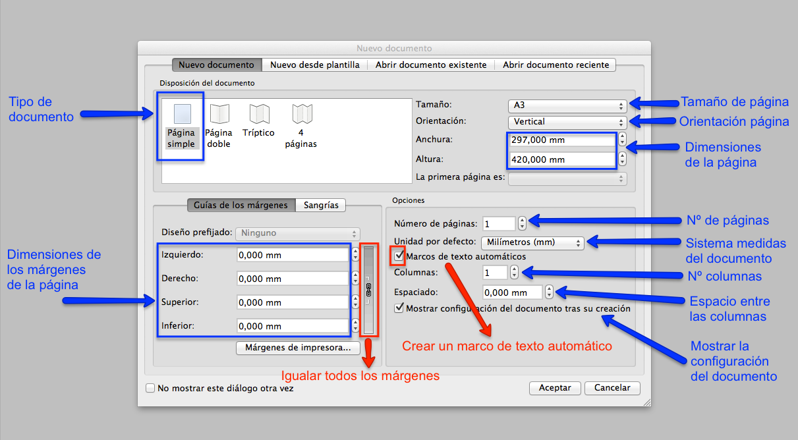
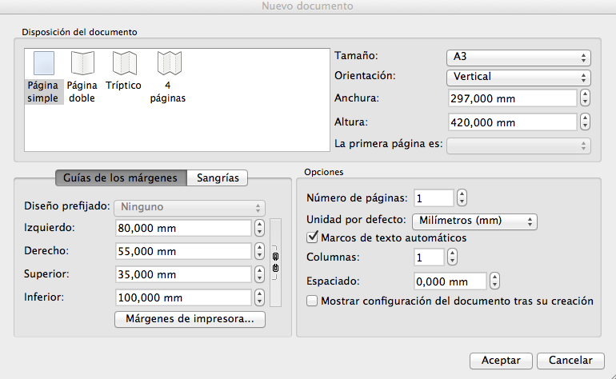

# Crear y configurar un documento

El primer paso para crear el cartel, es definir el formato del documento donde se maquetarán los textos e imágenes.

Al abrir Scribus, en la primera ventana, aparecen las opciones de CONFIGURACIÓN DEL DOCUMENTO. En esta ventana, se pueden definir las propiedades del documento.

Las opciones de configuración del documento están accesibles desde el menú principal Archivo / Configuración del documento.

A continuación, se configurará el documento, con las propiedades concretas, para hacer la práctica de crear un cartel con Scribus.

En primer lugar, se seleccionará en las opciones de disposición del documento la categoría de página simple.

Después, se elegirá en el apartado de opciones, en la unidad por defecto, la alternativa de milímetros. Con esta elección, los milímetros serán el sistema de medida utilizado durante el trabajo con este documento.

Por último, para acabar de definir las características del documento dónde se maquetará el cartel, se introducirán las siguientes elecciones:

- Tamaño de la página: A3 (Anchura 297 mm. y altura 420 mm.)

- Orientación de la página: Vertical

- Guías de los márgenes:

Izquierdo: 80 mm., Derecho: 55 mm., Superior: 35 mm., Inferior: 100 mm.

Si se desea que todos los márgenes del cartel sean iguales, se deberá activar la opción de "encadenar los márgenes".

Una vez que ya se han concretado todas las características del documento, se visualizará la siguiente ventana en Scribus.

Muestra de la configuración de un documento en Scribus.

