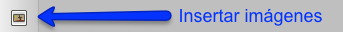
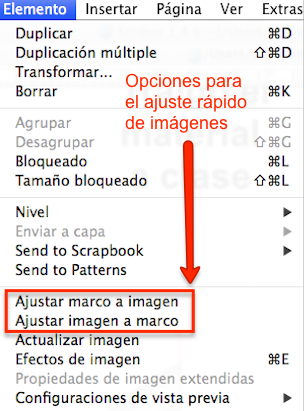
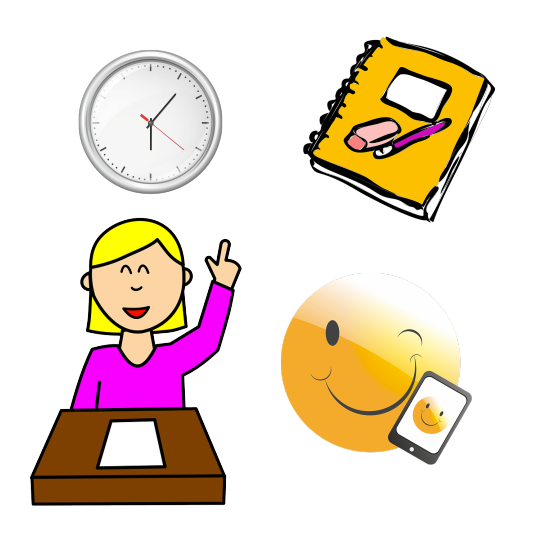
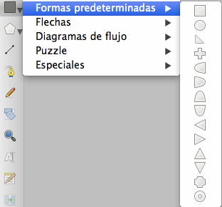
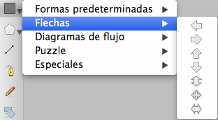
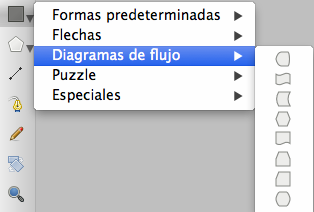
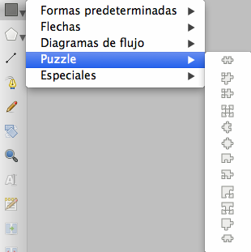
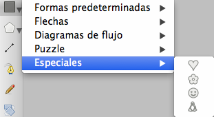
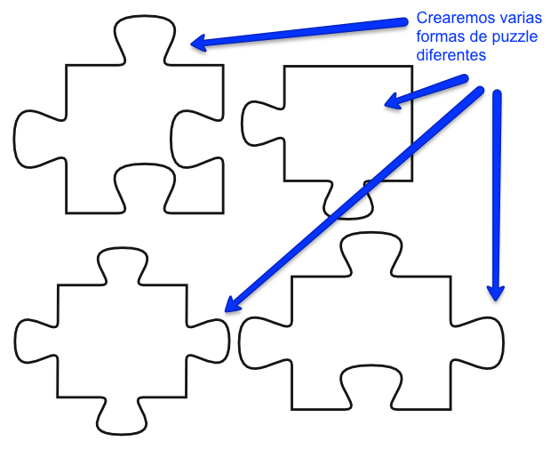

# Editar imágenes y objetos

En Scribus, para maquetar necesitaremos incorporar, además de TEXTOS, IMÁGENES, Y OTROS OBJETOS DE DIBUJO. Una forma rápida de incluir imágenes en los documentos, es utilizando el icono de acceso rápido “Insertar imágenes”. 

Icono de la herramienta Insertar Imagen en Scribus.

Con esta herramienta pincharemos y arrastraremos el cursor sobre la zona de trabajo del documento, creando una caja de imagen de tamaño libre. Después, para elegir la imagen que queremos colocar en la zona de trabajo, haremos doble click sobre la caja de imagen, hasta que aparezca un icono en forma de mano. Inmediatamente, se abrirá la ventana “Abrir imagen”. Y seleccionaremos la primera imagen para la maquetación del cartel, en este caso el archivo con el nombre “reloj.png”.

Al abrir imágenes, Scribus coloca en el documento las imágenes en su tamaño de archivo original. Para ajustar la imagen al tamaño necesario, usaremos la ventana “Propiedades” que se muestra a continuación.

Opciones de configuración de imágenes en la ventana Propiedades en Scribus.

Con estas utilidades podemos aumentar o disminuir el tamaño de las imágenes a la proporción deseada. La imagen del reloj la usaremos con un valor de tamaño del 15%.

Además, Scribus ofrece otras dos opciones muy útiles para el trabajo rápido con imágenes. Las podemos encontrar en el menú Elemento.

- "Ajustar marco a imagen": Adapta el tamaño del marco al tamaño de la imagen.

- "Ajustar imagen a marco": Unifica el tamaño de la imagen a las dimensiones del marco.

Utilidades para el ajuste de tamaño rápido de las imágenes en Scribus.

Para acabar de incorporar al documento las imágenes que compondrán el diseño del cartel, crearemos tres nuevas cajas de imagen. Y colocaremos en ellas los siguientes archivos, con estos tamaños de escala.

Caja de la imagen: “cuaderno.png”. Tamaño: 20%

Caja de la imagen: “alumno.png”. Tamaño: 30%

Caja de la imagen: “telefonomovil.png”. Tamaño: 20%

Al finalizar en el documento se visualizarán estas cuatro imágenes de muestra con las que se maquetará el cartel.

Apariencia de las imágenes de muestra usadas en el diseño del cartel.

Reloj por [Stux](https://pixabay.com/photo-499042/) bajo licencia [CC0 Public Domain](https://creativecommons.org/publicdomain/zero/1.0/)

Cuaderno por [FreeCliparts](https://pixabay.com/photo-9454/) bajo licencia [CC0 Public Domain](https://creativecommons.org/publicdomain/zero/1.0/)

Chica en clase por [Clker-Free-Vector-Images](https://pixabay.com/photo-307747/) bajo licencia [CC0 Public Domain](https://creativecommons.org/publicdomain/zero/1.0/)

Teléfono móvil por [Succo](https://pixabay.com/photo-1393371/) bajo licencia [CC0 Public Domain](https://creativecommons.org/publicdomain/zero/1.0/)

Scribus, también ofrece la posibilidad de crear objetos. En concreto permite la creación de cinco tipos de objetos.

1. Formas Predeterminadas

Icono para crear formas predeterminadas en Scribus.

2. Formas Flechas

Icono para crear flechas en Scribus.

3. Formas Diagramas de Flujo

Icono para crear diagramas de flujo en Scribus.

4. Formas Puzzle

Icono para crear puzzles en Scribus.

5. Formas Especiales

Icono para crear formas especiales en Scribus.

En el diseño del cartel usaremos los objetos de tipo puzzle. Necesitaremos crear varias formas de puzzle diferentes. Las cuatro piezas de puzzle destacadas usadas en el cartel de muestra son las que se muestran en la siguiente imagen.

Muestras de formas puzzle en Scribus.

