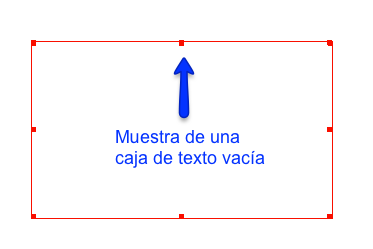
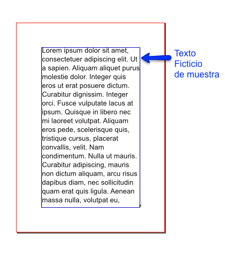
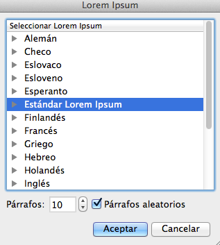
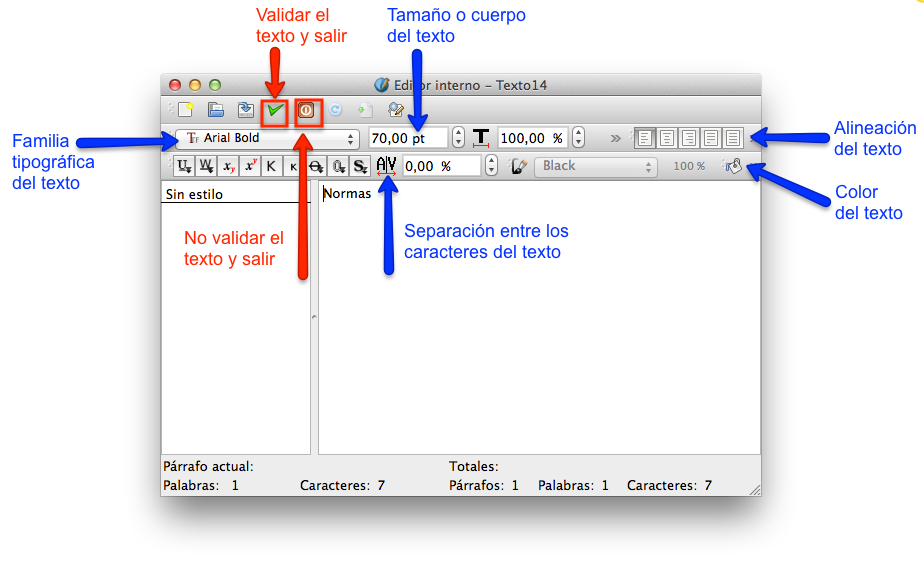
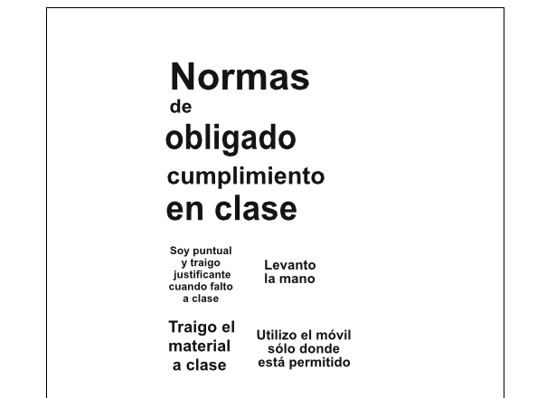
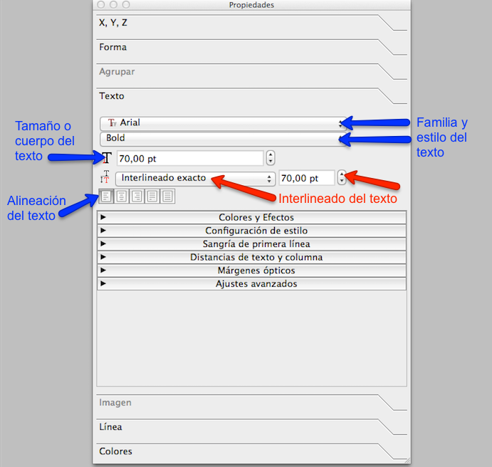

# Editar textos

La EDICIÓN DE TEXTOS y definición de las características de la tipografía, es una de las partes más importantes del trabajo del maquetador. En Scribus, para escribir textos se tienen que crear previamente marcos o cajas de textos con la herramienta, Insertar caja de texto. O desde el menú Insertar, seleccionando la opción “Insertar marco de texto”, o “Insert Text Frame”.

Icono de la Herramienta Insertar Cajas de Texto en Scribus.

Al seleccionar estas herramientas aparece un pequeño icono en forma de letra A. Después, pincharemos y arrastraremos de forma simultánea el cursor sobre la zona de trabajo del documento, y nos permitirá crear una caja de texto con forma libre, que acabará de formarse una vez que soltemos el cursor. La caja de texto tendrá el aspecto de la siguiente imagen.

En estas cajas de texto ya podemos empezar a escribir directamente, sólo tendremos que hacer doble click dentro de la caja de texto, y aparecerá el cursor parpadeando, indicándonos desde donde vamos a comenzar a escribir.

Para seleccionar y mover las cajas de textos, se usará la herramienta de seleccionar objetos.

Icono de la Herramienta de Selección de Objetos en Scribus.

En Scribus, las cajas de textos se pueden rellenar con texto ficticio, desde el menú Insertar. De esta forma se pueden visualizar con más rapidez muestras de variantes tipográficas, o de maquetación. 

Para agregar texto ficticio, se tiene que seleccionar la caja de texto que se quiera rellenar con el texto ficticio, Y, pulsar de forma simultánea la opción “Texto de muestra”, disponible en el menú Insertar. Y seleccionar la opción “Estándar Lorem Ipsum”, tal y como se visualiza en la siguiente imagen.

Ventana de las opciones de Texto Ficticio en Scribus.

Otra forma de editar texto con Scribus es usando el icono "Editar texto". 

Icono de la Herramienta Editar Texto en Scribus.

Al abrir este editor de texto nos aparecen un conjunto de opciones. Para continuar con el diseño del cartel, vamos a introducir los textos que incorporaremos al diseño. Comenzaremos escribiendo la palabra “Normas”. Y elegiremos la familia tipográfica que queramos utilizar. En el diseño de muestra se ha usado la familia Arial Bold. Después, introduciremos un valor para su tamaño de 70 puntos (pt.), y una alineación del texto, a la izquierda. Para finalizar, pulsaremos la opción para validar el texto y salir, tal y como se muestra en la imagen.

Ventana con las opciones del editor de textos en Scribus.

Para seguir practicando con las herramientas de edición de textos, acabaremos de introducir todos los textos que formarán parte del diseño del cartel. Lo haremos creando ocho nuevas cajas de textos. Y las editaremos introduciendo los siguientes textos entrecomillados, e introduciremos los siguientes valores para sus tamaños:

Caja de texto “de”, con tamaño de 35 pt., y alineación izquierda.

Caja de texto “obligado”, con tamaño de 60 pt., y alineación izquierda.

Caja de texto “cumplimiento”, con tamaño de 45 pt., y alineación izquierda.

Caja de texto “en clase”, con tamaño de 65 pt., y alineación izquierda.

Caja de “Soy puntual y traigo justificante cuando falto a clase”, con tamaño de 20 pt., y alineación centrada.

Caja de “Levanto la mano para hablar”, con tamaño de 25 pt., y alineación izquierda.

Caja de “Traigo el material a clase”, con tamaño de 30 pt., y alineación centrada.

Caja de “Utilizo el móvil sólo donde está permitido”, con tamaño de 25 pt., y alineación centrada.

Al terminar en nuestro documento de maquetación del cartel visualizaremos una información similar a la siguiente imagen.

Textos de muestra que configurarán el diseño del cartel.

Si en alguno de los textos quieres saltar alguna palabra de línea, selecciona el icono de la herramienta “Editar contenidos del marco” y coloca el cursor delante de la palabra que quieras saltar de línea. Después, pulsa de forma simultánea la tecla “mayúsculas “ y la tecla “enter” del teclado. Con esta acción se puede saltar de línea palabras del texto, con el objetivo de componer los textos para que queden visualmente más estéticos y equilibrados.

Icono de la Herramienta Editar Contenidos del Marco en Scribus.

Scribus, nos ofrece una herramienta más para la edición de los textos. Se trata de las opciones “Propiedades”, accesible desde el menú principal Ventana, en la zona superior del entorno de trabajo. En ella, podemos encontrar las siguientes utilidades para editar los textos.

Opciones de configurar texto de la ventana Propiedades en Scribus.

