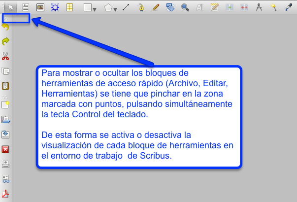

# El entorno de trabajo

Al trabajar con un documento en Scribus se muestran un conjunto de HERRAMIENTAS, con iconos de acceso directo. Estos bloques de herramientas (Archivo, Editar, Herramientas) pueden mostrarse, u ocultarse, en el entorno de trabajo de Scribus, tal y como se muestra en la siguiente imagen. También se puede cambiar su posición en la pantalla, pinchando y arrastrando sobre la zona marcada con puntos, hasta que aparezca un icono en forma de cruz, para desplazarlas a la zona de la pantalla donde al usuario le resulte más cómoda su visualización, durante la sesión de trabajo con Scribus. 

En Scribus los bloques de herramientas pueden mostrarse u ocultarse según la necesidad de su uso.

Las herramientas más útiles que se sitúan en la zona superior de la ventana de trabajo, son las herramientas de Archivo, las herramientas de Editar, y los iconos de Herramientas. Estas herramientas de acceso rápido facilitan crear nuevos documentos, abrir documentos ya archivados, guardar los documentos, cerrar los documentos, e imprimir los documentos en Scribus. También permiten guardar un documento en formato de Scribus, como un documento de tipo ".PDF".

Bloque de herramientas de Archivo en Scribus.

Los siguientes iconos sirven para deshacer o rehacer alguna de las acciones hechas con Scribus. Y para cortar, copiar o pegar objetos en Scribus.

Bloque de herramientas de Editar en Scribus.

A continuación, se presenta uno de los conjuntos de herramientas más importantes en Scribus. Reúne los iconos que permiten la edición y organización de textos, imágenes, fórmulas, tablas, y objetos de dibujo en Scribus.

Esta es una de las paletas de Herramientas más útiles en Scribus.

En la siguiente imagen se muestran las herramientas situadas en la zona inferior izquierda de la pantalla. Algunos de estos iconos son de uso frecuente en Scribus porque ayudan a controlar el porcentaje de zoom de visualización de los documentos, acercando o alejando la zona de trabajo del documento que se quiere visualizar, con más o menos detalle. Además, también permiten el desplazamiento a través de las diferentes páginas creadas en los documentos.

Opciones de visualización del zoom en el documento en Scribus.

Por último de las herramientas situadas en la zona inferior derecha de la pantalla la más utilizada será el icono de activar o desactivar el modo de vista preliminar. Se usará cuando se quiera visualizar el documento con el aspecto final, tal y como se visualizará en caso de realizarse su producción impresa, sin que se visualicen los márgenes, marcos, cuadrícula o guías del documento.

Icono de activación o desactivación del modo de vista preliminar en Scribus.

