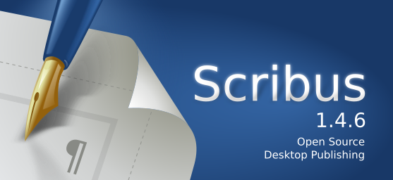

# Módulo 2: Uso básico de Scribus

Scribus, es un software libre de autoedición que sirve para maquetar páginas con textos, e imágenes. Al igual que otros programas comerciales de autoedición como QuarkXPress y Adobe InDesign, Scribus permite crear libros, revistas, carteles, o tríptico,s con un diseño gráfico personalizado.

Para empezar a trabajar con Scribus, hay que familiarizarse con el entorno de trabajo. En este módulo, se presentan las herramientas, y opciones básicas, que nos permitirán empezar a editar y componer textos, e imágenes, con Scribus.

