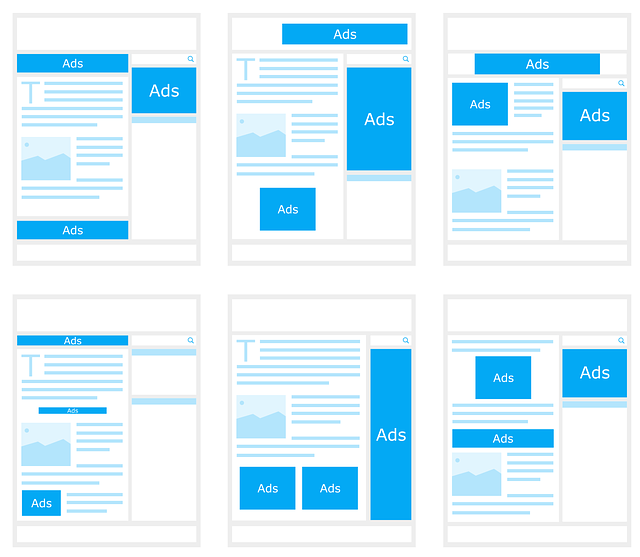

# Modulo 3: Maquetar con Scribus

La función de la MAQUETACIÓN VISUAL, consiste en crear estructuras gráficas pregnantes, con los textos, e imágenes, de los soportes gráficos. Se ocupa de definir, organizar, y jerarquizar la información visual, con ayuda de una retícula, o estructura compositiva oculta. En función de la jerarquía visual que se establezca se generarán recorridos visuales que guiarán y ayudarán al lector a tener una agradable lectura. Y, en el caso del diseño gráfico de materiales educativos a que se pueda conseguir una rápida y motivadora asimilación de los contenidos educativos.

Retículas por [JuralMin](https://pixabay.com/photo-1663031/) bajo licencia [CC0 Public Domain](https://creativecommons.org/publicdomain/zero/1.0/)

