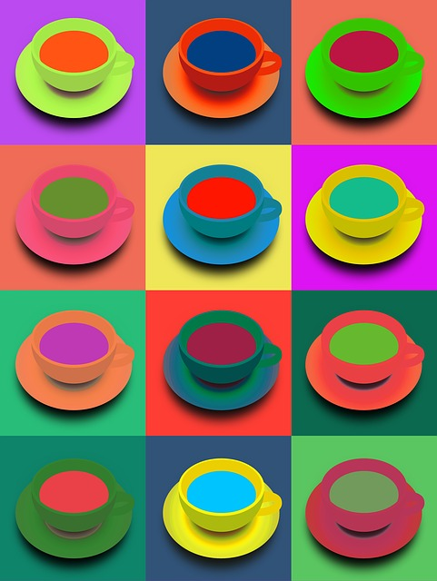

# La sintaxis del lenguaje visual

En la síntesis de la imagen, se diferencian varios elementos del ALFABETO VISUAL que influyen en la percepción. Villafañe (2006) clasifica los elementos morfológicos de la representación, en tres categorías:

1. Los elementos morfológicos de la imagen: punto, línea, plano, textura, color, y forma.

2. Los elementos escalares de la imagen: dimensión, formato, proporción, y escala.

3. Los elementos dinámicos de la imagen: dirección visual, peso visual (equilibrio y tensión), ritmo visual, y movimiento visual.

El PUNTO es la unidad mínima de representación, con propiedades de dimensión, forma y color. En maquetación, el uso del punto puede influir en la percepción, aunque no esté gráficamente representado, si lo usamos para crear un centro de atención. También pueden resultar útiles sus propiedades dinámicas si se quieren generar fuerzas visuales como la dirección visual, el equilibrio, o la tensión.

La LÍNEA en la diagramación tiene propiedades dinámicas, pudiendo condicionar la dirección de lectura de la información. También será útil cuando sea necesario separar planos entre sí.

Líneas por [Geralt](https://pixabay.com/photo-1500063/) bajo licencia [CC0 Public Domain](https://creativecommons.org/publicdomain/zero/1.0/)

El PLANO es un elemento morfológico bidimensional delimitado por líneas, u otros planos, con propiedades de color y textura. En maquetación, sus aplicaciones más comunes son usarlo para separar información, o para representar la tercera dimensión.

La TEXTURA es un elemento morfológico superficial con propiedades de color, y plano. Aplicada a la maquetación aporta cualidades táctiles, u ópticas, y permite describir el aspecto superficial de los objetos representados. 

Percibimos el COLOR a través de las células fotorreceptoras, bastones y conos, sensibles a las longitudes de onda de la luz visible. Los modelos de color usados actualmente se basan en los parámetros, tono, saturación y luminosidad. El TONO, o matiz, es la diferencia existente entre un color u otro. La SATURACIÓN, es el grado de pureza de un color. Y, la LUMINOSIDAD, es la cantidad de luz de un color. Existen tres tipos principales de mezcla de color. La MEZCLA ADITIVA, o suma de luces con diferentes longitudes de onda, es la que se utiliza en los monitores de ordenador, o televisión. La MEZCLA SUSTRACTIVA o sustracción de longitudes de onda a través de la combinación de pigmentos, es la que se emplea en las pinturas artísticas, o en las tintas de las imprentas. Y, la MEZCLA PARTITIVA producida al visualizar de forma simultánea zonas de diversos colores, utilizada en la impresión en cuatricomía en las artes gráficas.

Círculo cromático por [Geralt](https://pixabay.com/photo-455365/) bajo licencia [CC0 Public Domain](https://creativecommons.org/publicdomain/zero/1.0/)

La combinación de colores puede generar armonías, o contrastes cromáticos. Los colores son armónicos, cuando en su composición cromática participa algún tono en común, son armónicos los colores que tienen posiciones contiguas en el círculo cromático. Por contra, se genera un contraste de color si no se cumple con esta norma de armonía cromática, resultan contrastados los colores con posiciones enfrentadas en el círculo cromático. En maquetación, el uso de color aporta la máxima utilidad al establecer la jerarquía de los elementos gráficos, aportando diferenciación, y agrupamiento.

Contrastes de color por [Geralt](https://pixabay.com/photo-624724/) bajo licencia [CC0 Public Domain](https://creativecommons.org/publicdomain/zero/1.0/)

En cuanto a la FORMA, se pueden distinguir dos conceptos. Por un lado, la forma material de un objeto, y por otro lado, la forma percibida del objeto mediante los sentidos. Gracias a la ley de la pregnancia de la Gestalt conocemos que el ser humano tiende a percibir mejor las formas cuanto más simples son. Este es un principio muy útil en maquetación.

La DIMENSIÓN, o tamaño de los objetos, en maquetación puede aplicarse para trasmitir profundidad. También resulta útil en el establecimiento de la jerarquización de la información, y comparte, junto con la estructura y el color, la influencia sobre el peso visual.

Al maquetar, al definir el FORMATO, se define la PROPORCIÓN que existe entre los lados del soporte gráfico. Algunas de las proporciones más utilizadas son el formato áureo (1:1,6), o el formato DIN (1:1,4).

Por último, la ESCALA usada en maquetación permite relacionar los objetos de la realidad, o referentes con los objetos representados, a través de los signos o imágenes.

____________________

Villafañe, J. (2006). *Introducción a la teoría de la imagen*. Pirámide

