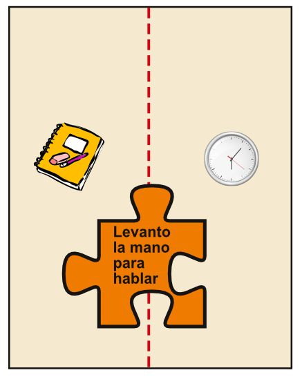
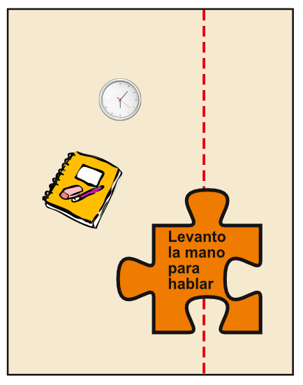
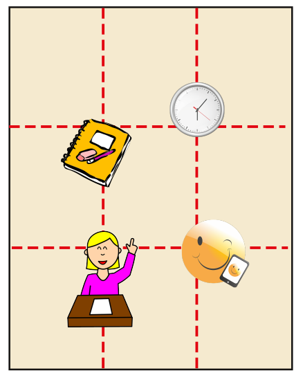

# Percepción y composición

Nuestro sistema perceptivo percibe las FUERZAS PERCEPTUALES existentes en las composiciones visuales. Estas fuerzas, por ejemplo, provocan que determinados elementos visuales se atraigan, o repelen entre si. 

En la definición de la DIRECCIÓN VISUAL compositiva, hay fuerzas visuales que actúan en favor de los ejes vertical y horizontal, debido a diversas influencias cognitivas, como el orden de lectura en el sentido de izquierda a derecha, en la cultura occidental. En maquetación, el establecimiento de direcciones visuales, a través del uso de los recursos gráficos, facilita la lectura de forma fluida, y entretenida.

El PESO VISUAL depende del tamaño, color, textura y posición, en el espacio, de los elementos visuales. A continuación, se resumen algunas de las causas del peso visual que pueden utilizarse en maquetación.

FACTORES QUE OTORGAN UN MAYOR PESO VISUAL

- La orientación vertical, frente a la oblicua, u horizontal.

- Una mayor proximidad a los ejes horizontal-vertical, o a las diagonales.

- La posición en el lado derecho.

- La situación en el lado superior.

- Un mayor tamaño.

- Los colores cálidos.

- Una mayor luminosidad de color.

- Más contraste de color.

Al maquetar, el uso de la alternancia al situar los elementos gráficos pueden generar estructuras de RITMO de tipo alterno, creciente o decreciente, radial, o concéntrico. El RITMO Y MOVIMIENTO VISUAL ayudan en maquetación, a mantener la atención sobre la composición visual.

Existen diversas reglas compositivas que pueden servir como retícula de apoyo al maquetar, y que facilitan el trabajo de componer visualmente textos, e imágenes.

La LEY DE LA BALANZA, consiste en situar en el eje de simetría el objeto que se quiere destacar. El resto de objetos se sitúan próximos a una distancia semejante. El resultado es un conjunto compositivo equilibrado.

Ejemplo de composición basada en la Ley de la Balanza.

En la LEY DE COMPOSICIÓN DE MASAS el objeto destacado se desplaza del eje de simetría, y el resto de objetos se sitúan a diferentes distancias del centro con un mayor o menor tamaño. El resultado de la composición resulta desequilibrado.

Muestra de composición con la Ley de Composición de Masas.

La REGLA DE LOS TERCIOS, divide el espacio compositivo en tercios, tanto verticalmente como horizontalmente. Da como resultado, una cuadrícula de nueve espacios con cuatro intersecciones, tal y como se muestra en la imagen. El resultado de la composición es asimétrico.

Ejemplo de composición según la Regla de los Tercios.

