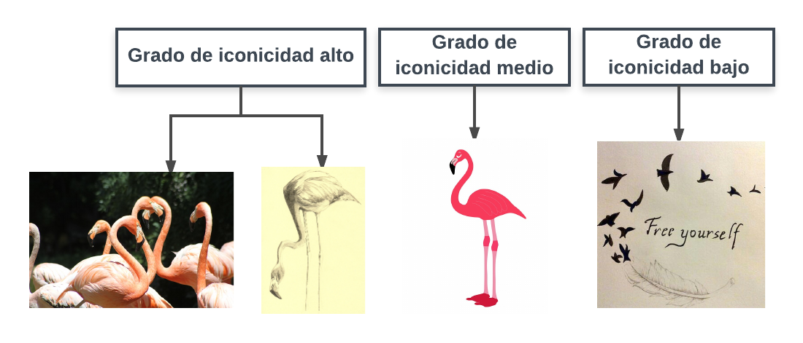

# Signos e imágenes

En el lenguaje visual se utilizan SIGNOS e IMÁGENES. Un signo visual es cualquier cosa que representa a otra, a través del lenguaje visual. Ferdinand de Saussure (1857-1913) plantea la teoría del signo dual, representada en el siguiente esquema:

Charles Sanders Peirce (1839-1914) clasifica los signos en tres categorías, teniendo en cuenta el vínculo que tienen con sus referentes. Según esta clasificación, se pueden diferenciar tres tipos de signos: índices, iconos, y símbolos.

Los signos de tipo índices tienen una relación con sus referentes de tipo física, con una relación de causa-efecto. Los signos de tipo iconos tienen una relación con los referentes de semejanza. Y los signos de tipo símbolos tienen una relación con sus referentes de arbitrariedad, establecida mediante una convención.

Una imagen es una unidad de representación, producida mediante el lenguaje visual. Las imágenes pueden tener un grado de iconicidad, o de mimetismo, con los objetos representados alto, se tratan de imágenes hiperrealistas, o figurativas. O pueden tener un nivel de iconicidad bajo, o de abstracción, son imágenes en las que predominan los rasgos subjetivos, y expresivos, frente a los componentes miméticos.

Flamencos por [Eruizben](https://pixabay.com/photo-1869183/) bajo licencia [CC0 Public Domain](https://creativecommons.org/publicdomain/zero/1.0/)

Flamenco por [Liziart](https://pixabay.com/photo-656422/) bajo licencia [CC0 Public Domain](https://creativecommons.org/publicdomain/zero/1.0/)

Flamenco por [Kaz](https://pixabay.com/photo-924795/) bajo licencia [CC0 Public Domain](https://creativecommons.org/publicdomain/zero/1.0/)

“Tatoo 14 Liberate” por [Andres Oliva](https://flic.kr/p/tQusXt) bajo licencia [CC0 Public Domain](https://creativecommons.org/publicdomain/zero/1.0/)

En el lenguaje visual las imágenes pueden tener dos planos de significado: el plano de significado denotativo, y el plano de significado connotativo.

En las imágenes denotativas predominan los aspectos descriptivos, objetivos, e informativos. Mientras que en las imágenes connotativas, prevalecen los rasgos subjetivos, y expresivos.

Teniendo en cuenta el objetivo que persigue el uso de las imágenes, se pueden encontrar cuatro tipos de imágenes: 1. Imagen expresiva, 2. Imagen informativa, 3. Imagen persuasiva, 4. Imagen narrativa.

Avión por [Unsplash](https://pixabay.com/photo-1030855/) bajo licencia [CC0 Public Domain](https://creativecommons.org/publicdomain/zero/1.0/)

“Anuncio cigarros 207” por [Luis Fernando Reis](https://flic.kr/p/avhCmo) bajo licencia [CC BY 2.0](https://creativecommons.org/licenses/by/2.0/)

“De caratulas, portadas y cubiertas” por [Cristian Eslava](https://flic.kr/p/7wCxRg) bajo licencia [CC BY 2.0](https://creativecommons.org/licenses/by/2.0/)

En las imágenes expresivas existe una intencionalidad de comunicación de los sentimientos del autor, son imágenes en las que el creador ofrece una visión subjetiva del tema tratado. 

Las imágenes informativas tienen como objetivo reflejar circunstancias reales. En este caso, el creador de la imagen no aporta ningún rasgo personal al significado de la imagen.

Las imágenes persuasivas tienen la intención de influir en la forma de actuar del público objetivo con intenciones comerciales, ideológicas, o de otro tipo.

Y, las imágenes narrativas tienen el objetivo de ilustrar, y transmitir historias.

