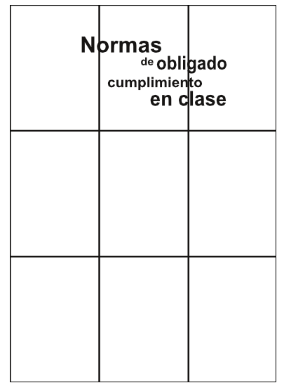
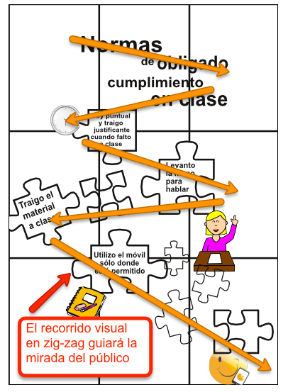

# Transformar objetos

En Scribus, se pueden TRANSFORMAR OBJETOS con la ayuda de la ventana “Propiedades”, y las opciones localizadas en la paleta de herramientas, con nombre "X, Y, Z". Desde esta pestaña podremos definir los valores de anchura, y altura de los objetos, rotarlos, agrupar o desagrupar varios objetos, o generar simetrías verticales, u horizontales.

Aspecto de las opciones de transformación de objetos en Scribus.

Para empezar a componer el cartel recuperaremos el texto que ya tenemos editado “Normas de obligado cumplimiento en clase”. Lo hemos escrito en seis cajas de texto independientes para que ahora podamos darle una composición más dinámica. Construye el titular del cartel para que su aspecto sea similar a la siguiente imagen. Este texto será el que tenga una mayor importancia en la jerarquía visual de la información del cartel.

Muestra de la composición de los textos del titular del cartel.

En Scribus, las cajas de textos e imágenes se ordenan, poniéndolas en el orden y nivel de superposición necesario, con respecto al resto de elementos visuales. Se hace usando la opción “Subir o bajar niveles”, que se muestra a continuación. La opción “Traer al frente”, pone el objeto seleccionado en el nivel superior, mientras que la opción “Enviar al fondo” envía los objetos seleccionados al nivel inferior del documento.

Aspecto de la opción “Subir o bajar niveles” en Scribus.

A continuación, acabaremos de componer, los cuatro mensajes secundarios del cartel, que ya estaban editados, superponiéndolos sobre las cuatro piezas de puzzle creadas en el módulo 2. Al acabar, el aspecto del cartel tiene que ser semejante a la siguiente imagen.

Ejemplo del aspecto del cartel con el titular y los textos secundarios.

Ahora es el momento de incorporar al diseño del cartel, las cuatro imágenes que ya estaban insertadas en el documento, en el módulo 2. Y de distribuirlas para que el aspecto del cartel sea parecido a la siguiente imagen.

Apariencia del cartel con los textos e imágenes.

Por último, incorporaremos al diseño del cartel varias piezas de puzzle extra, para que el diseño del cartel resulte más interesante. Y las distribuiremos generando un recorrido visual en zig-zag, que guiará la mirada del público objetivo a través de toda la información. El objetivo es guiar a la mirada para que comience a ver el cartel desde la parte superior izquierda del cartel, y para que termine en la zona inferior derecha del cartel, tal y como se muestra con las flechas en la siguiente imagen.

Trazado del recorrido visual en zig-zag.

Se puede observar que, salvo en las imágenes, el cartel todavía no tiene ningún color. En el próximo apartado, se creará una gama cromática personalizada para darle al cartel un mayor impacto visual, a través del uso del color.

 

